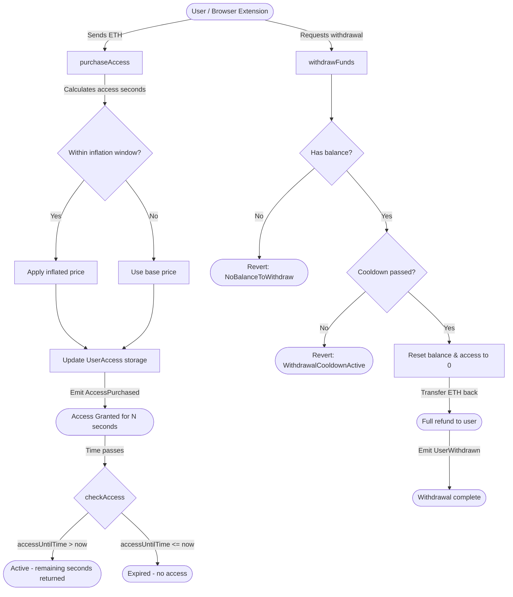

<p align="center">
   
</p>

# Thadai Smart Contract

The **Thadai Smart Contract** (`ThadaiCore`) is the decentralized access control engine powering the Thadai productivity ecosystem. It enables blockchain-based, time-limited access to restricted web resources, creating a financial incentive for users to stay focused and avoid distractions.

Users stake ETH as skin-in-the-game for time management — purchasing access to blocked websites costs real money, but funds are fully refundable (subject to a withdrawal cooldown). This makes ThadaiCore a **commitment device**, not a revenue-extracting protocol.

## Architecture



## Key Features

- **Time-Based Access Control**: Users purchase access time to blocked websites by sending ETH. Access is granted for the purchased duration only.
- **On-Chain Payments**: All access purchases and withdrawals are handled on-chain, ensuring transparency and decentralization.
- **Immutable & Ownerless**: The contract has no admin, no pause key, and no upgrade path. All configuration is fixed at deploy time. See [SECURITY.md](./SECURITY.md) for the full trust model.
- **Full Refundability**: Users can withdraw their entire deposited balance after a cooldown period — this is intentional by design.
- **Dynamic Inflation**: Rapid repeat purchases within a configurable time window incur a price increase, discouraging impulsive access buying.
- **Event Emission**: Emits `AccessPurchased` and `UserWithdrawn` events for off-chain monitoring and indexing.

## Contract Interface

External contracts can integrate via [`IThadaiCore`](./src/IThadaiCore.sol) — a lightweight interface that exposes all public functions, errors, and events without importing the implementation or its dependencies (e.g. OpenZeppelin's ReentrancyGuard).

### Core Functions

| Function | Description |
|----------|-------------|
| `purchaseAccess()` | Pay ETH to buy access time |
| `checkAccess(address)` | Check if a user has active access and remaining seconds |
| `withdrawFunds()` | Withdraw full balance after cooldown (protected by `nonReentrant`) |
| `getUserAccessInfo(address)` | Get comprehensive user data: balance, access expiry, cooldown status, inflation |
| `getAccessPricingInfo()` | Get contract configuration: base price, minimum payment, cooldown, inflation |
| `calculateAccessFromPayment(uint256, uint256)` | Preview how many seconds a given payment would buy |
| `getContractBalance()` | Get total ETH held by the contract |

## Usage

This contract is designed to be deployed on any EVM-compatible blockchain and can support access-control for various applications, such as the [Thadai Chrome Extension](https://github.com/dev-vim/thadai-chrome-extension/tree/main).

### Build & Test

```sh
forge build
forge test
```

### Gas Snapshots

```sh
forge snapshot
```

### Local Deployment (with Anvil)

See [DEPLOY.md](./DEPLOY.md) for detailed deployment instructions using Foundry and Anvil.

### Interacting

- Use the Thadai Chrome Extension for end-user interaction.
- Use `cast` or any ethers-compatible tool for direct contract calls.

## Pricing (Production Deploy)

Current production parameters target **$2,200/ETH**:

| Parameter | Value | Target |
|-----------|-------|--------|
| Base access price | `631,313,131,313 wei/sec` | ~$5 for 1 hour |
| Minimum payment | `909,090,909,090,909 wei` | ~$2 minimum |
| Withdrawal cooldown | 1 day | Prevents rapid cycling |
| Inflation window | 1 hour | Discourages impulsive re-purchases |
| Inflation percent | 10% | Price increase for rapid top-ups |

> **Note:** These values are hardcoded at deploy time. A Chainlink price feed integration is planned for a future version to dynamically adjust for ETH/USD volatility.

## Security

See [SECURITY.md](./SECURITY.md) for the full security model, threat analysis, and vulnerability reporting.
